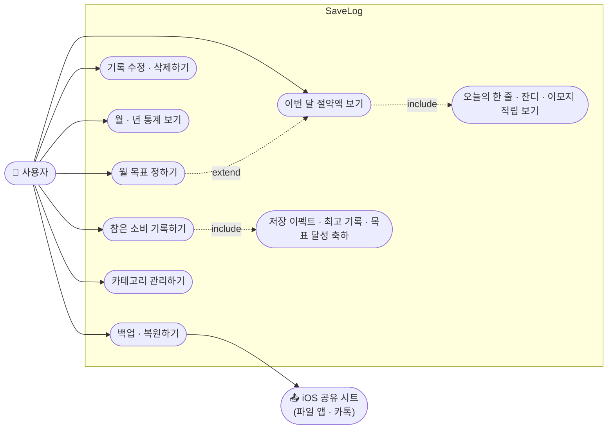
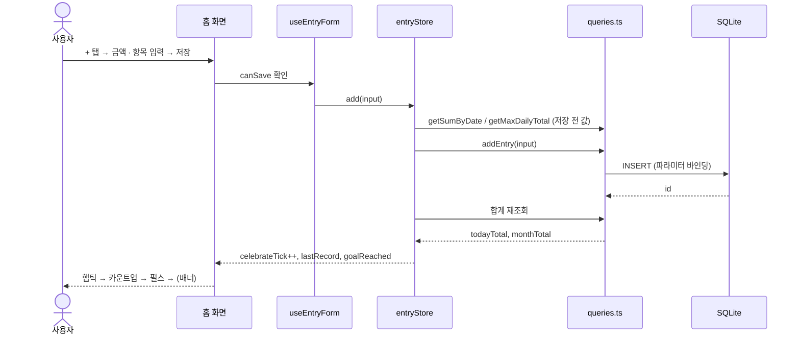
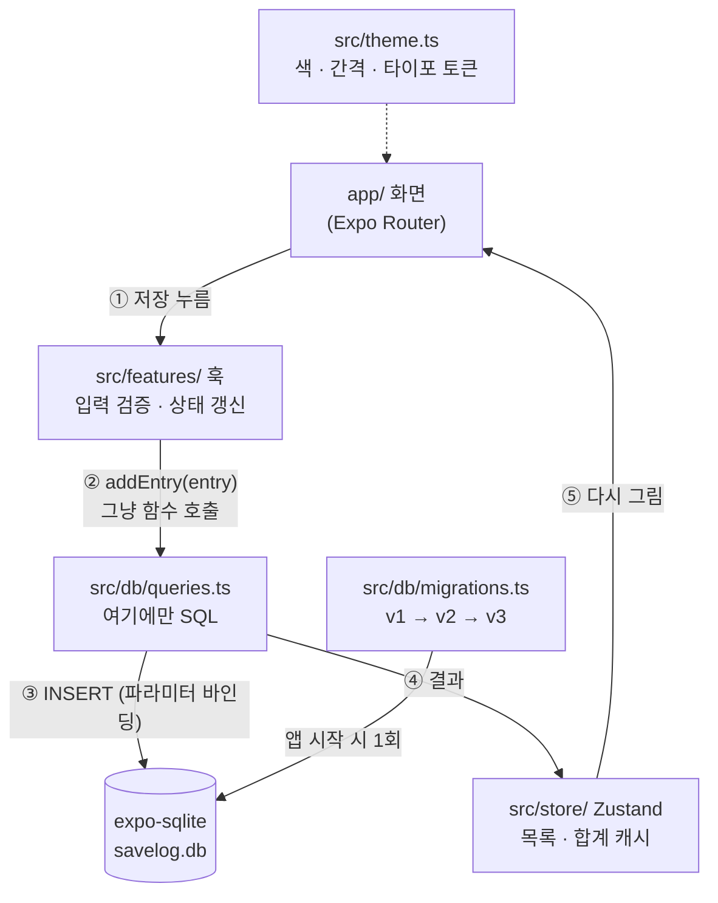
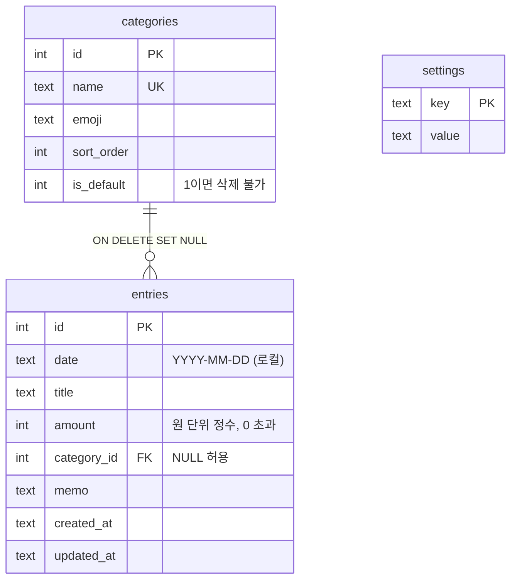
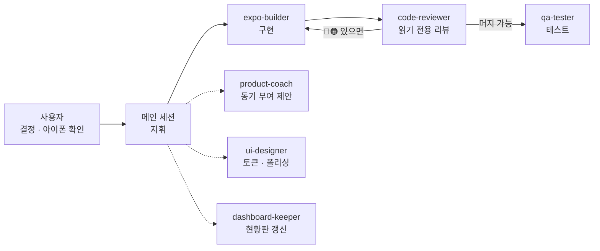

<div align="center">

# 💰 SaveLog

### "오늘 참은 소비"를 기록하는 절약 앱

커피 한 잔, 배달 한 번을 참을 때마다 항목과 금액을 적는 개인용 iOS 앱입니다.
**날짜별 · 월별 · 연별로 얼마를 아꼈는지** 보여줍니다. 저장할 때마다 짧은 축하 이펙트가 나옵니다.


</div>

---

## 📖 소개

가계부는 "쓴 돈"을 적지만 SaveLog는 **"안 쓴 돈"** 을 적습니다.
실제 지출은 추적하지 않습니다. 참은 소비만 쌓아 "이번 달에 이만큼 아꼈다"는 숫자를 키웁니다.

- 서버 · 로그인 없음. 데이터는 아이폰 SQLite에만 저장
- Windows PC + 아이폰 Expo Go만으로 개발 (Mac 없음)
- 기획 → 구현 → 리뷰 → 테스트를 역할별 AI 서브 에이전트가 분담, 사람은 결정만

## 🧭 유스케이스

사용자는 한 명(개발자 본인)입니다. 외부 참여자는 iOS 공유 시트뿐입니다.



| 유스케이스 | 트리거 | 결과 |
|---|---|---|
| 참은 소비 기록하기 | 홈의 `+` (길게 누르면 원탭 저장) | 기록 저장, 카드 움츠림 → 타격(햅틱 + 효과음) → 카운트업 + 적립 라벨 + 글로우. 4천원↑ 컨페티, 2만원↑ 세 번 터짐 + 플래시 두 번 + 화면 흔들림. 최고 기록·목표 달성 시 배너 |
| 기록 수정 · 삭제 | 행 탭 / 왼쪽 스와이프 | 수정 화면 또는 확인 후 삭제. 이펙트 없음 |
| 이번 달 절약액 보기 | 앱 열기 | 카드 큰 숫자, 목표 진행 바, 오늘의 한 줄, 이번 달 잔디, 이모지 적립 줄 |
| 월 · 년 통계 | 기록 탭 | 합계 · 건수 · 평균, 막대, 카테고리 비율, 전체 목록 |
| 월 목표 정하기 | 설정 탭 | 프리셋 또는 직접 입력, 홈 카드에 즉시 반영. 달성 시 축하(목표당 월 1회) |
| 백업 · 복원 | 설정 탭 | JSON 내보내기 → 공유 시트 / JSON 선택 → 병합 또는 덮어쓰기 |

### 🔁 저장 한 번의 시퀀스



## ✨ 주요 기능

| # | 기능 | 요약 |
|---|---|---|
| 1 | 기록 입력 | 금액(자동 콤마) · 항목 · 카테고리 칩(10개) · 빠른 입력 칩 · 날짜 · 메모. `+` 길게 누르기로 최근 항목 원탭 저장, 금액 프리셋 칩. 저장 시 햅틱 + 효과음 + 금액 카운트업 + 카드 타격, 4천원 이상 컨페티 · 2만원 이상 세 번 터짐 + 플래시 + 화면 흔들림 |
| 2 | 홈 | 이번 달 절약액 카드, 날짜별 목록, 스와이프 삭제, 수정 화면, 🔥 연속 기록일, 누적 금액, 매달 초 지난달 회고 카드 |
| 3 | 기록 탭 | 월 / 년 단위 전환, 기간 이동, 막대 그래프(월: 일별 31칸 · 년: 월별 12칸, 막대는 누른 채 좌우로 쓸기), 카테고리별 비율 바, 년 모드 목록은 월별 섹션 |
| 4 | 개인 최고 | 하루 · 한 달 역대 최고를 처음 넘길 때 "최고 기록! 🏆" |
| 5 | 월 목표 | 목표 금액 설정(프리셋 · 직접 입력), 진행 바, 달성 후에도 초과액 계속 표시, 달성 이펙트 |
| 6 | 홈 활기 | 오늘의 한 줄(명언 39개 · 속담·유명인 · 환산 · 어제 대비), 하루 첫 오픈 카운트업, 이번 달 잔디, 이모지 적립 |
| 7 | 백업 | JSON 내보내기 · 복원, CSV, 카테고리 관리 (M5) |

### 🎯 저장 순간의 이펙트

기록을 저장하면 시트가 내려간 순간 카드가 움츠러들었다 튀어 오르며 햅틱·효과음과 함께 숫자가 카운트업합니다.
"+4,500원 적립" 라벨과 글로우가 뜨고, 수정 저장에는 이펙트가 없습니다.
4천원 이상은 컨페티와 "짠" 효과음, 2만원 이상은 컨페티 세 번 터짐과 화면 플래시 두 번·흔들림에 "쾅" 효과음이 더해집니다.
효과음은 등급별로 톡·짠·쾅·팡파르·띵 5개이고 생성한 WAV로 무음 스위치를 따르며, 설정에서 끄거나 미리 들을 수 있습니다.

### 📊 막대 그래프는 View로 직접

차트 라이브러리는 Expo Go 호환 문제가 생길 수 있어 `View`로 직접 그립니다.
월 모드는 31칸, 년 모드는 12칸입니다. 칸 전체가 터치 영역이고 막대 폭은 칸의 70%입니다.

### 🌱 기록 없이 열어도 반응하는 홈

기록이 없는 날도 카드 위에 절약 명언이 한 줄 뜹니다. 기록이 있으면 어제 대비나 환산 문구로 바뀝니다.
이번 달 잔디와 이모지 적립 줄은 기록과 무관하게 항상 보입니다.

## 🛠 기술 스택

| 구분 | 기술 | 비고 |
|---|---|---|
| 앱 | Expo SDK 57 · React Native · Expo Router | 파일 기반 라우팅, 탭 3개 |
| 언어 | TypeScript (strict, `any` 금지) | |
| 저장 | expo-sqlite (동기 API) | `schema_version` 테이블로 마이그레이션 관리 |
| 상태 | Zustand | 화면 로컬 상태는 `useState` |
| 애니메이션 | react-native-reanimated 4 · gesture-handler | 카운트업, 펄스, 스와이프 |
| 효과음 | expo-audio · 생성 WAV | 무음 스위치 준수 |
| 날짜 | dayjs (locale ko) | `2026년 9월 23일 (수)` |
| 테스트 | jest-expo · @testing-library/react-native · sql.js | sql.js로 expo-sqlite를 대역해 DB 계층까지 PC에서 검증 |
| 개발 도구 | Claude Code 서브 에이전트 7개 | 아래 "개발 방식" 참고 |

## 🏗 아키텍처

저장 한 번의 흐름입니다. **SQL은 `src/db/` 안에만** 있습니다. 화면과 훅은 함수만 호출합니다.



## 🗄 데이터 모델



카테고리를 지우면 기록의 `category_id`만 NULL이 됩니다. 기록은 연쇄 삭제하지 않습니다.
적용된 마이그레이션은 고치지 않고 새 버전을 덧붙입니다 (v1 초기 스키마 → v2 밥값 카테고리 → v3 settings → v4 옷 카테고리).

## 📁 프로젝트 구조

```
savelog/
├── app/                    # Expo Router 화면 (라우팅과 조립만)
│   ├── (tabs)/
│   │   ├── index.tsx       # 홈: 이번 달 카드 + 입력 + 최근 기록
│   │   ├── monthly.tsx     # 기록: 월/년 토글, 막대, 카테고리, 전체 목록
│   │   └── settings.tsx    # 설정: 월 목표, 백업/복원, 카테고리
│   └── entry/[id].tsx      # 기록 수정
├── src/
│   ├── db/                 # SQLite 연결, 마이그레이션, 쿼리 (SQL은 여기만)
│   ├── store/              # Zustand 스토어
│   ├── features/           # 화면별 훅 + 순수 계산 함수
│   ├── components/         # 재사용 UI
│   ├── utils/              # 금액 · 날짜 포맷
│   └── theme.ts            # 디자인 토큰
├── __mocks__/expo-sqlite.ts  # sql.js 기반 대역 (jest 전용)
├── assets/sounds/          # 저장 효과음 WAV (생성 파일)
├── scripts/gen-sounds.mjs  # 효과음 WAV 생성 스크립트
├── docs/
│   ├── PRD.md              # 제품 요구사항, 마일스톤
│   └── DESIGN.md           # 디자인 가이드
└── .claude/
    ├── agents/             # 서브 에이전트 7개
    └── commands/           # /feature, /check 등
```

## 🤖 개발 방식

역할별 Claude Code 서브 에이전트가 기능 하나를 구현 → 리뷰 → 테스트 순서로 처리합니다. 사람은 범위와 디자인 방향을 정합니다.



리뷰어는 구현 과정을 모르는 새 컨텍스트에서 결과물만 봅니다.

> 💡 구현·리뷰 과정에서 잡은 문제: 년 모드가 일별 섹션으로 나오던 PRD 불일치, 동기 SQLite 쓰기의 try/catch 누락, 재연결 시 `PRAGMA foreign_keys` 꺼짐.

## 🚀 로컬 실행

Windows + 아이폰 기준입니다. Mac은 필요 없습니다.

```bash
npm install
npx expo start
```

아이폰에 **Expo Go**를 설치합니다. PC와 같은 Wi-Fi에서 터미널의 QR을 카메라로 찍으면 앱이 열립니다.

```bash
npx tsc --noEmit   # 타입 검사
npx expo lint      # 린트
npx jest           # 테스트 (sql.js로 DB 계층까지)
npx expo-doctor    # 의존성 호환 점검
```

> 💡 Expo Go에 로그인했다면 PC의 CLI도 같은 계정이어야 합니다. 구글 SSO 계정은 expo.dev에서 액세스 토큰을 만들어 `EXPO_TOKEN` 환경 변수에 넣습니다.

## 🗺 로드맵

| 단계 | 내용 | 상태 |
|---|---|---|
| M1 뼈대 | 프로젝트, 탭, 테마, SQLite 초기화 | ✅ |
| M2 기록 | 입력 모달, 목록, 수정 · 삭제, 저장 이펙트 | ✅ |
| M3 통계 | 월 · 년 이동, 막대, 카테고리 합계, 개인 최고 | ✅ |
| M3.5 월 목표 | settings, 진행 바, 달성 이펙트 | ✅ |
| M3.6 홈 활기 | 오늘의 한 줄, 첫 오픈 카운트업, 잔디, 이모지 적립 | ✅ |
| M4 편의 | 빠른 입력 칩, 연속 기록일, 누적 이정표, 회고 카드 | ✅ |
| M4.5 입력 마찰 줄이기 | 원탭 저장, 프리셋 칩, 자동 포커스 | ✅ |
| M5 백업 | JSON 내보내기 · 복원, CSV, 카테고리 관리 | 🔨 |

## 👤 Author

**zizonpubao** · Built with [Claude Code](https://claude.com/claude-code)

개인용 앱이라 앱스토어 출시 계획은 없습니다. 안드로이드도 같은 코드로 동작합니다. EAS Build로 APK를 만들 수 있습니다.
